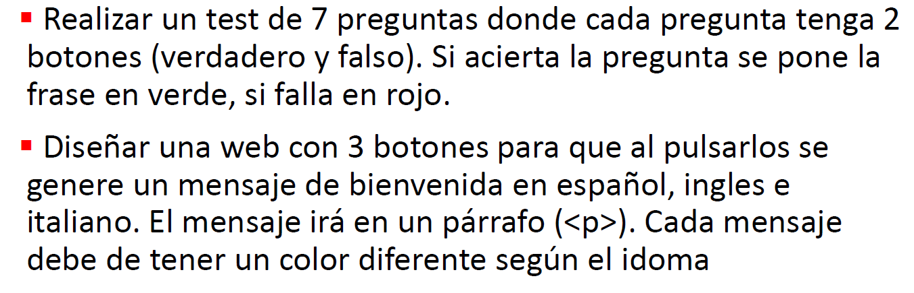
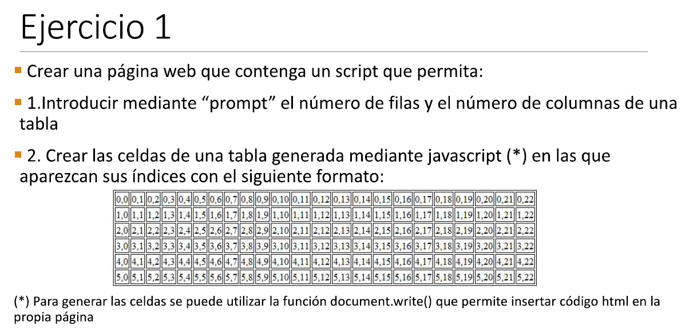
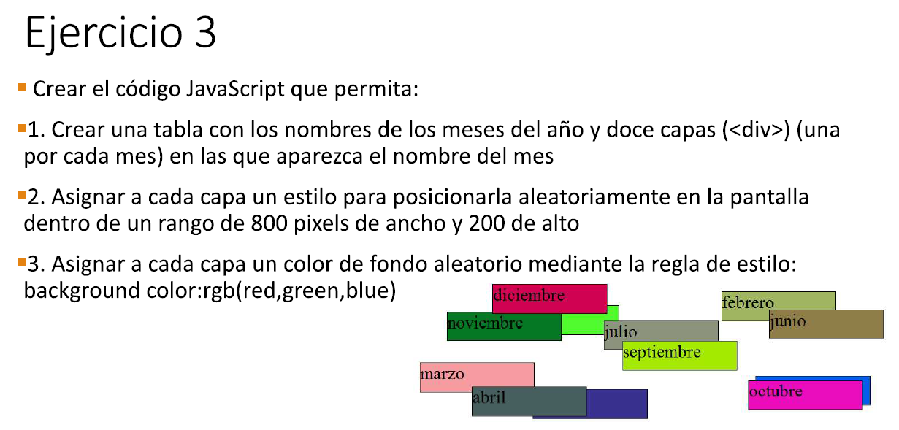
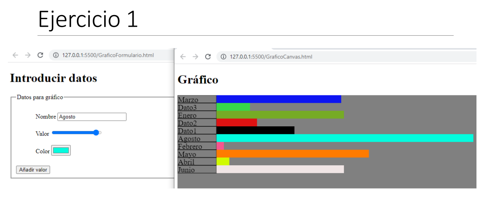

# DAW-Exercises

Todos (o todos los que me acuerde de subir) los ejercicios del grado de desarrollo de aplicaciones web

## Desarrollo web en entorno cliente

## Ejercicios Tema 1

## Ejercicios Tema 2

## Ejercicios Tema 3

**Ejercicio 3 Objetos**

## Ejercicios Tema 4

## Ejercicios Tema 5

